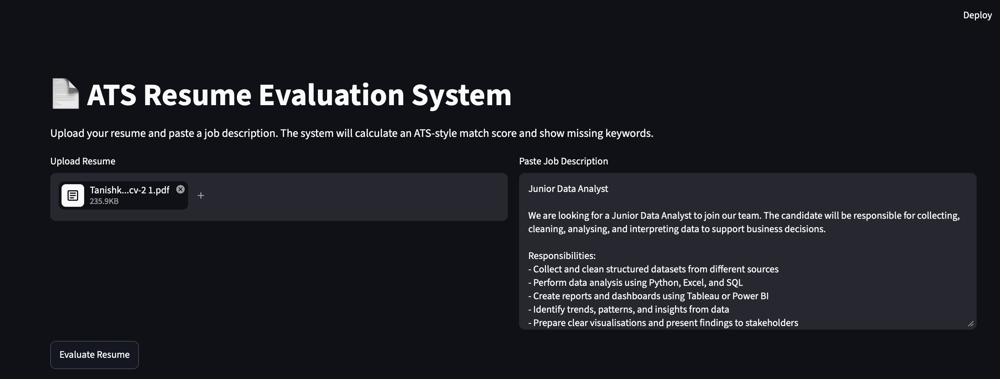
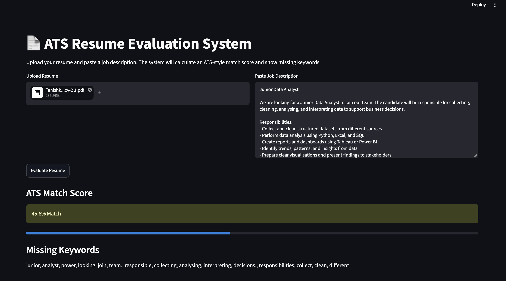
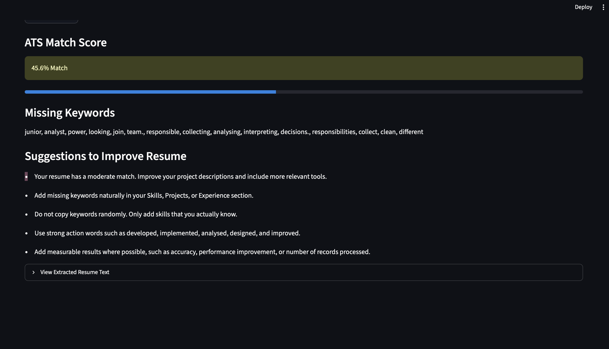

# ATS Resume Evaluation System

The ATS Resume Evaluation System is a Python and Streamlit web application that compares a resume with a job description and gives an ATS-style match score.

## Project Overview

This project helps users check how well their resume matches a job description. The user uploads a resume in PDF or DOCX format and pastes a job description. The system calculates a match score, shows missing keywords, and gives suggestions to improve the resume.

## Features

- Upload resume in PDF or DOCX format
- Paste job description
- Extract text from resume
- Calculate ATS match score
- Show missing keywords
- Give resume improvement suggestions
- Simple Streamlit web interface

## Tech Stack

- Python
- Streamlit
- scikit-learn
- pdfplumber
- python-docx
- pandas
- Natural Language Processing

## Screenshots

### Home Page


### Result Page


### Suggestions


## How to Run

Install dependencies:

```bash
pip install -r requirements.txt
streamlit run app.py

